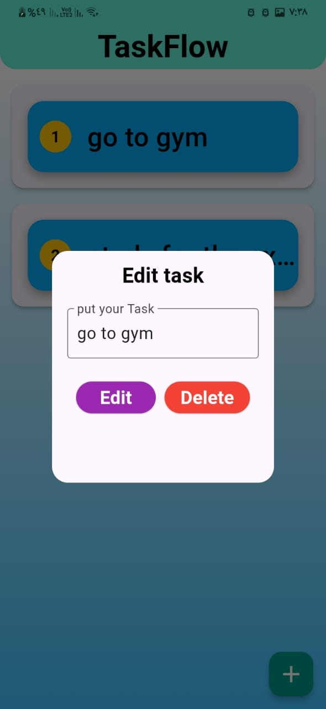

# TaskFlow - To-Do List App

TaskFlow is a simple and intuitive to-do list app built using Flutter. It helps users organize their tasks efficiently, allowing them to stay on top of their day-to-day responsibilities.

## Features

- **Task Management**: Add, edit, and delete tasks with ease.
- **Intuitive Design**: Clean and simple user interface for smooth navigation.
- **Flutter Framework**: Built using Google's Flutter framework for cross-platform support.
- **Google Fonts**: Uses Google Fonts for enhanced typography.

## ⭐️ If you find this project useful, please give it a star! ⭐️
Your support helps me to keep improving and maintaining this project. Thank you!

## Technologies Used

- **Flutter**: A UI toolkit for crafting natively compiled mobile, web, and desktop applications.
- **Dart**: A programming language for building the app.
- **Google Fonts**: This is used to fetch custom fonts in the app.

## Setup and Installation

### Prerequisites
- **Flutter SDK**: Ensure you have Flutter installed. You can download it from the official Flutter website.
- **Dart SDK**: Installed alongside Flutter.
- **Google Fonts Package**: The `google_fonts` package is used in the app. Make sure it is added to your `pubspec.yaml`.

### Installation

1. Clone the repository:
    ```bash
    git clone https://github.com/Islam-Ragab015/TaskFlow.git
    ```

2. Navigate into the project directory:
    ```bash
    cd TaskFlow
    ```

3. Install dependencies:
    ```bash
    flutter pub get
    ```

## Screenshots of the app:

Here are some screenshots of the **TaskFlow** app in action:


*Main task management screen.*


*Task details view showing task editing.*


*Completed task view.*

## Contributing

Contributions are welcome! Please fork this repository, make changes, and submit a pull request.

1. Fork the repository.
2. Create a new branch:
    ```bash
    git checkout -b feature-branch
    ```
3. Make changes and commit them:
    ```bash
    git commit -m 'Add some feature'
    ```
4. Push to the branch:
    ```bash
    git push origin feature-branch
    ```
5. Submit a pull request.

## License

This project is licensed under the MIT License - see the [LICENSE](LICENSE) file for details.

